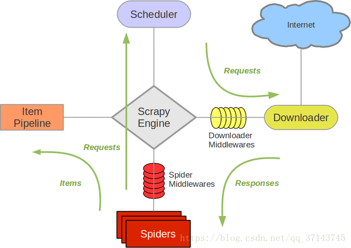

# scrapy
# 爬虫框架
 - scrapy
    - 概述
        - pip install scrapy （conda install scapy 失败)
        - ScrapyEnging: 神经中枢，大脑，核心
        - Scheduler 调度器: 引擎发出来的request请求，调度器需要处理，然后教给引擎
        - Downloader 下载 器
        - Spider 爬虫:负责把下载器得到的网页/结果进行分解，分解成数据+链接
        - ItemPipeline 管道，详细处理Item
        - DownloaderMiddleware 下载中间件，自定义下载的功能扩展组件
        - SpiderMiddleware 爬虫中间件，对spider 进行功能扩展
        - 流程图
            -         
 - 项目流程
    - 新建项目：scrapy startproject xxx
    - 明确需要目标/产出 编写 item.py
    - 制作爬虫： 地址  spider/xxxspider.py
    - 存储内容： piplines.py      
 -  ItemPipeline
    - 对应的是pipelines 文件
    - 爬虫提取出数据存入item 后，item中保存的数据需要进一步处理，比如清洗，去重，存储等
    - pipeline 需要处理process_item函数
        - process_item
            - spider 提取出来的item作为参数传入，同时传入的还有spider
            - 此方法必须实现
            - 必须返回一个Item对象，被丢弃的item不会被之后的pipeline处理  
    - __init__ 构造 函数
    - open_spider
        - spider 对象被开启的时候调用
    - close_spider
        - spider 对象被关闭的时候调用
 - Spider
    - 对应的是文件夹Spiders下的文件
    - __init__: 初始化爬虫名称，start_urls 列表
    - start_requests:生成Requests 对象交给Scrapy 下载并返回response
    - parse： 根据返回的response解析处对应的item，item自动进入pipline,如果需要，解析初url,url 自动交给requests 模块，一直循环下去
    - start_request 此方法仅能被调用一次,读取start_urls内容并启动循环过程
    - name: 设置爬虫名称
    - start_urls 设置开始第一批爬取的url
    - allow_domains spider允许爬取的域名列表    
    - log 日志记录
 - 中间件
    - 中间件是处于引擎和下载器中间的一层的组件
    - 可以有多个，按顺序加载执行
    - 作用是对发出请求和返回的结果进行预处理  
    - 在middlewares 文件中
    - 需要在settings 中设置以便生效   
    - 一般一个中间件完成一项功能
    - 必须实现以下一个或者多个方法
        - process_request(self, request, spider)
            - 在request 通过的时候被调用
            - 必须返回None 或Response 或 Request 或 raise IgnoreRequest
            - None scrapy 将继续处理该request
            - Request： scrapy会停止调用process_request 并冲洗调度返回的request
            - Response scrapy 不会调用其它的process_request 或者process_exception ，直接将该response 作为结果返回， 同时会调用process_response
            - 
        - process_response(self, request, spider)
 - 去重
    - 爬过得就不爬了,防止出现死循环
    - 即在spider 的parse 函数中，返回Request 的时候加上 dont_filter = False 参数
 - 结合 Selenium，重写中间件即可（process_request)，取代downloader 组件    
 - scrapy shell
    - 一步步对网站进行分析 
    - scrapy shell "https://www.baidu.com" 
 - 分布式爬虫
    - 单机爬虫的问题
        - 单机效率
        - IO吞吐量
    - 多爬虫问题
        - 数据共享
        - 在空间上不同的多台机器，可以成为分布式    
    - 解决办法
        - 使用共享队列的方式    
        - 去重
    - Redis
        -  内存数据库
        - 同时可以落地保存在硬盘
        - 可以去重
        - 可以裂解为一个dict set list 的集合体    
        - 可以对保存的内容进行生命周期控制
    - 数据库
        - MongoDB
        - Mysql
    -  scrapy_redis   
 - 推荐书籍
    - Python 爬虫开发与项目实战 范传辉 机械工业出版社
    - 精通python爬虫框架scrapy 李斌 翻译 人民邮电出版社
    - 
              
 
                
                    